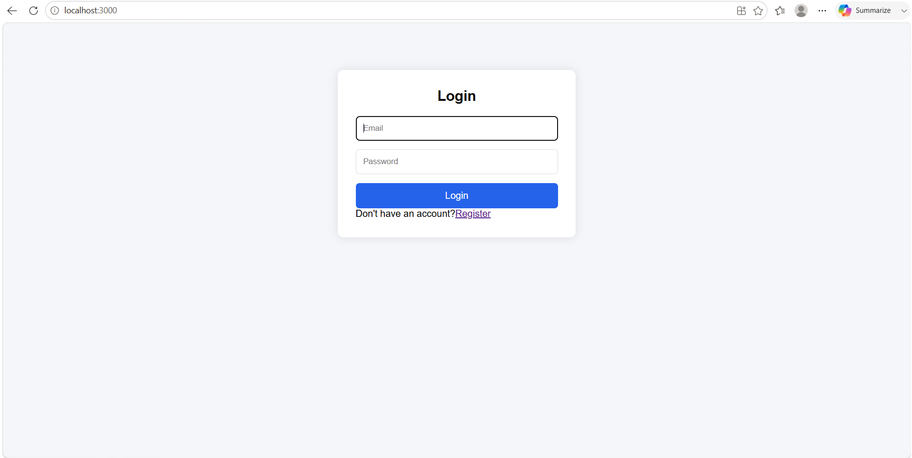
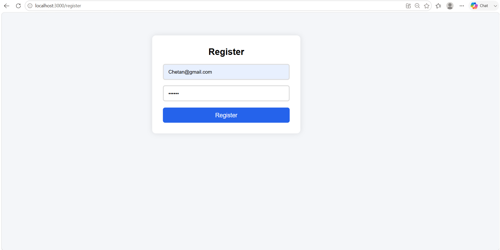
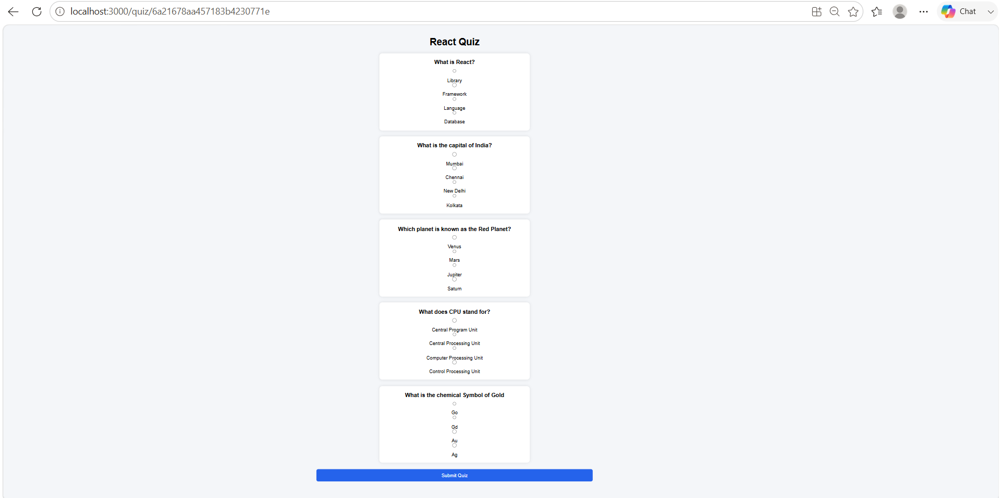
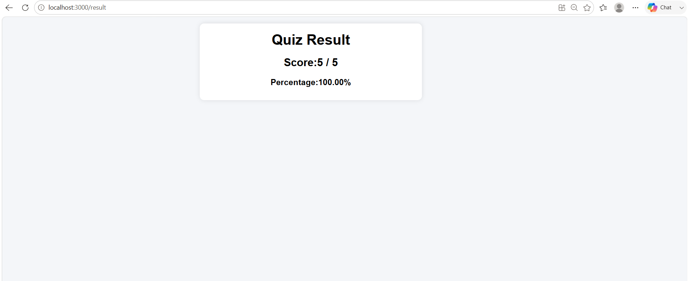

# QuizPlatform

## Intern Details

- Name: Chetan Bhivate
- Intern ID: CITS2466

## Overview

QuizPlatform is a full-stack quiz application built using the MERN stack (MongoDB, Express.js, React.js, and Node.js). It allows users to register, log in, attempt quizzes, and view their scores. Quiz data is stored in MongoDB and managed through REST APIs.

## Features

* User Registration and Login
* View Available Quizzes
* Attempt Quizzes
* Automatic Score Calculation
* Result Display After Submission
* MongoDB Database Integration
* Responsive User Interface

## Tech Stack

### Frontend

* React.js
* React Router DOM
* Axios
* CSS

### Backend

* Node.js
* Express.js

### Database

* MongoDB
* Mongoose

## Project Structure

```text
QuizPlatform
│
├── backend
│   ├── config
│   ├── models
│   ├── routes
│   ├── server.js
│   └── .env
│
├── frontend
│   ├── src
│   │   ├── pages
│   │   ├── components
│   │   ├── App.jsx
│   │   └── main.jsx
│   └── package.json
│
└── README.md
```

## Installation

### Clone Repository

```bash
git clone https://github.com/Chetan-dev306/QuizPlatform.git
cd QuizPlatform
```

### Backend Setup

```bash
cd backend
npm install
npm start
```

### Frontend Setup

```bash
cd frontend
npm install
npm start
```

## Environment Variables

Create a `.env` file in the backend folder:

```env
MONGO_URI=your_mongodb_connection_string
JWT_SECRET=your_secret_key
PORT=5000
```

## API Endpoints

### Authentication

* POST /api/auth/register
* POST /api/auth/login

### Quiz

* GET /api/quizzes
* GET /api/quizzes/:id
* POST /api/quizzes

### Results

* POST /api/results
* GET /api/results

## Future Improvements

* Admin Dashboard
* Add/Edit/Delete Questions
* Leaderboard
* Quiz Categories
* Timer-Based Quizzes
* User Profile Management

## Screenshots

### Login Page


### Register Page


### Quiz Page


### Result Page


## Author

Chetan Bhivate

## License

This project is developed for learning purpose.
